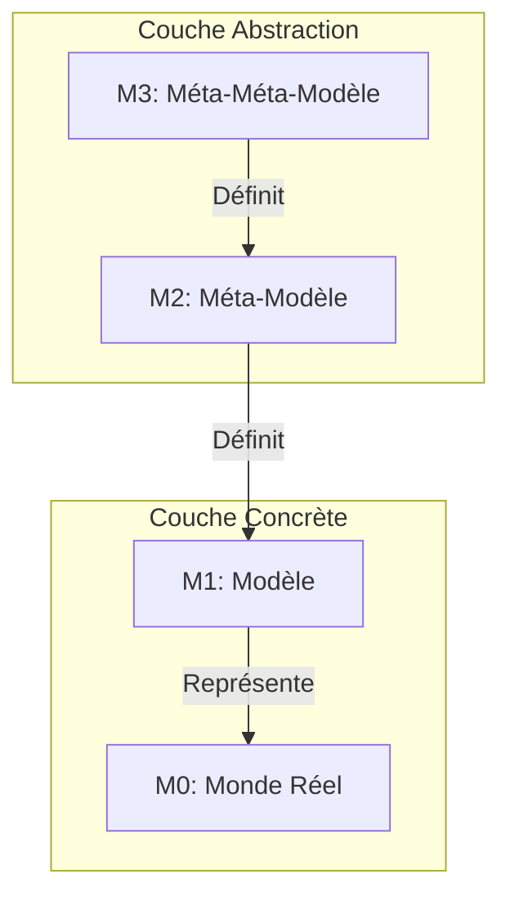
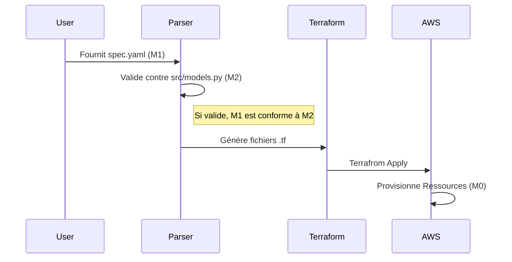

# 📐 Architecture de Modélisation (M0 - M3)

Ce document détaille l'architecture de modélisation du projet **Ctrl-Alt-Deploy** en suivant les principes de l'**Ingénierie Dirigée par les Modèles (IDM)** et de l'architecture **MDA (Model Driven Architecture)**.

Il situe conceptuellement nos fichiers de configuration, nos classes Python et notre infrastructure réelle dans la **pyramide MOF (Meta-Object Facility)** définie par l'OMG.


---
## 🏛️ La Pyramide de Modélisation (MOF)

Le projet structure ses données et définitions selon les 4 niveaux d'abstraction classiques :



---

## 🔍 Détail des Niveaux

### 🔹 M3 : Méta-Méta-Modèle (Le Langage)
C'est le langage utilisé pour définir notre métamodèle. Il fournit les primitives de base (Class, String, Integer, ValidationRule).
Dans ce projet, le niveau M3 est constitué par :
*   **Python Class System** (type, object)
*   **Pydantic Metaclasses** (`BaseModel`, `Field`, `Enum`)
*   **JSON Schema Specification** (indirectement, via la sérialisation des modèles Pydantic)

**Rôle** : Fournir la grammaire pour écrire le M2.

### 🔹 M2 : Méta-Modèle (La Structure)
C'est la définition abstraite de ce qu'est un "Déploiement valide". Il ne contient pas de données spécifiques à un projet, mais la structure que tout projet doit respecter.
*   **Fichiers source** : `src/models.py`
*   **Composants** :
    *   `DeploymentSpec` (Racine)
    *   `Service` (Entité)
    *   `AWSConfig` (Configuration)
    *   `ServiceType` (Énumération : EC2, RDS, ECS)

**Exemple de code M2 (src/models/models.py) :**
```python
class Service(BaseModel):
    name: str = Field(..., max_length=64)
    type: ServiceType = Field(default=ServiceType.EC2)
    scaling: Optional[ScalingConfig] = None
    
    @field_validator('ports')
    def validate_ports(cls, v):
        # Règle de validation du niveau M2
        ...
```
**Rôle** : Définir les règles, les types et les relations autorisés.

### 🔹 M1 : Modèle (L'Instance Concrète)
C'est une instance spécifique du méta-modèle. C'est le fichier écrit par l'utilisateur pour décrire SON application.
*   **Fichiers** : `spec.yaml`, `spec.json`
*   **Nature** : Description déclarative d'une infrastructure souhaitée.

**Exemple de M1 (spec.yaml) :**
```yaml
aws:
  region: "us-east-1"

application:
  services:
    - name: "my-backend"  # Instance de M2:Service.name
      type: "EC2"         # Instance de M2:ServiceType
      ports: [8080]
```
**Rôle** : Capturer l'intention de l'utilisateur conforme aux règles du M2.

### 🔹 M0 : Monde Réel (L'Exécution)
Ce sont les objets physiques ou virtuels qui existent réellement lors de l'exécution.
*   **Éléments** :
    *   L'instance EC2 `i-0123456789` qui tourne sur AWS.
    *   La base de données RDS active.
    *   Le VPC créé avec l'ID `vpc-abcde`.

**Rôle** : La réalité opérationnelle tangible.

---

## 🔄 Flux de Transformation (Model Transformation)

Le projet agit comme un moteur de transformation de modèles :

1.  **Parsing & Validation** : `M1 (spec.yaml)` -> Validation contre `M2 (Pydantic Models)`
2.  **Model-to-Text (M2T)** : Le modèle validé est transformé en code Terraform via Jinja2.
3.  **Exécution** : Terraform applique le code pour créer `M0`.



## 💡 Pourquoi cette architecture ?

*   **Séparation Modèle/Méta-modèle** : Permet de faire évoluer les règles (M2) sans casser le moteur, juste en demandant aux utilisateurs de mettre à jour leurs fichiers (M1).
*   **Indépendance** : Le modèles (M1) est agnostique de l'implémentation technique finale (Terraform, CloudFormation, Pulumi). Seul le générateur change.
*   **Validation Forte** : Impossible de créer une ressource M0 invalide car le M1 est rigoureusement vérifié contre le M2 avant toute action.
