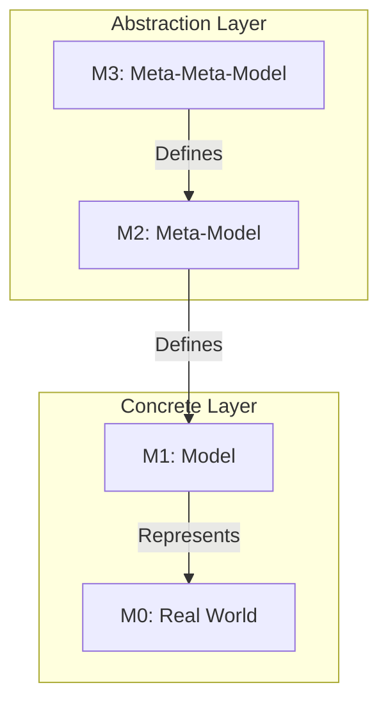
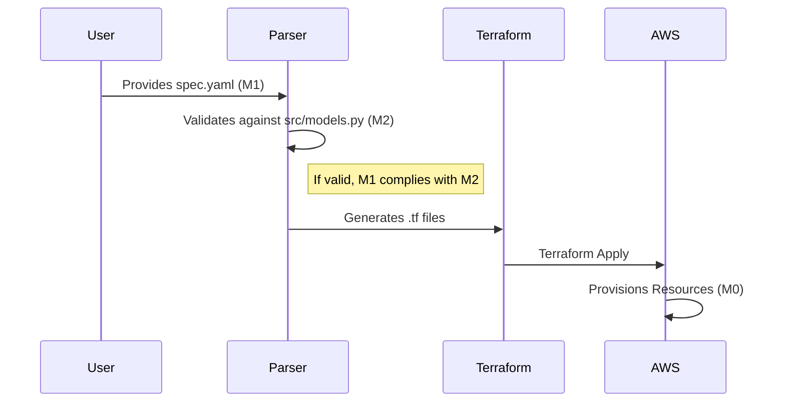

# 🚀 Ctrl-Alt-Deploy

**Ctrl-Alt-Deploy** is a powerful cloud deployment automation platform that radically simplifies the process of deploying applications on AWS. By replacing thousands of lines of complex infrastructure code with a single, intuitive specification file, it democratizes cloud access for developers and organizations.

## 📄 Abstract

**Ctrl-Alt-Deploy** is an advanced cloud deployment automation tool that bridges the gap between high-level architectural intent and concrete infrastructure provisioning. By leveraging Model-Driven Architecture (MDA) principles, it allows developers to define complex AWS infrastructures using simple, validated specifications (JSON/YAML), which are then automatically transformed into secure, production-ready Terraform code. This project addresses the complexity of modern cloud operations by providing a robust, 4-layer abstraction pipeline: Input, Validation, Generation, and Execution.

## 📑 Table of Contents

- [🎯 Project Overview](#-project-overview)
  - [The Problem](#the-problem)
  - [The Solution](#the-solution)
  - [Use Cases](#use-cases)
- [🏗️ Technical Architecture](#%EF%B8%8F-technical-architecture)
  - [Technology Stack](#technology-stack)
  - [Architecture Layers](#architecture-layers)
  - [Modeling Concepts](#modeling-concepts)
- [🔄 Workflow](#-workflow)
- [📐 Modeling Architecture (M0 - M3)](#-modeling-architecture-m0---m3)
  - [The Modeling Pyramid (MOF)](#%EF%B8%8F-the-modeling-pyramid-mof)
  - [Level Details](#-level-details)
  - [Transformation Flow](#-transformation-flow-model-transformation)
  - [Why this architecture?](#-why-this-architecture)
- [📂 Project Structure](#-project-structure)
- [⚙️ Installation & Setup](#%EF%B8%8F-installation--setup)
  - [Prerequisites](#prerequisites)
  - [Backend Setup](#1-backend-setup-python)
  - [Frontend Setup](#2-frontend-setup-cli)
- [🚀 Usage](#-usage)
  - [Define your Specification](#1-define-your-specification)
  - [Validate the Specification](#2-validate-the-specification)
  - [Deploy](#3-deploy)
- [🧪 Testing & Quality Assurance](#-testing--quality-assurance)
  - [Running Tests](#running-tests)
  - [Test Categories](#test-categories)
- [🛠 Features](#-features)
- [🤝 Contributing](#-contributing)

---


---

## 🎯 Project Overview

### The Problem
Traditional cloud deployment requires deep expertise in tools like Terraform, Docker, AWS SDKs, and networking. This creates a bottleneck where developers depend on OPS/DevOps teams for every deployment, slowing down time-to-market and increasing the risk of configuration errors.

### The Solution
**Ctrl-Alt-Deploy** introduces a layer of abstraction that handles the complexity for you.
- **Simplicity**: Define your entire infrastructure in one readable `spec.json` or `spec.yaml` file.
- **Speed**: Deploy full-stack applications with a single command.
- **Reliability**: Built-in validation ensures configurations are logical and secure before any resource is created.
- **Standardization**: Enforce best practices automatically across all deployments.

### Use Cases
- **Startups**: Launch products rapidly without hiring a dedicated DevOps engineer.
- **Dev Teams**: Focus on application code while the platform handles the infrastructure.
- **Training**: valid environments for learning cloud concepts without the configuration headache.

---

## 🏗️ Technical Architecture

This project utilizes a robust 5-layer architecture to transform high-level specifications into running AWS infrastructure.

### Technology Stack
| Layer | Technologies | Role |
|-------|-------------|------|
| **Interface** | Node.js, Typer/Click | User CLI experience |
| **Orchestration** | Python | Control logic & sequencing |
| **Validation** | Pydantic, JSONSchema | Syntax & Semantic checks |
| **Generation** | Terraform, Jinja2 | Dynamic IaC generation |
| **Automation** | Terraform CLI, AWS SDK | Infrastructure provisioning |

### Architecture Layers
```mermaid
graph TD
    L5[5. User Interaction Layer (CLI)] -->|deploy run spec.json| L4
    L4[4. Infrastructure Automation Layer] -->|Terraform CLI, AWS SDK| L3
    L3[3. Core Control Logic] -->|Orchestrator| L2
    L2[2. Infrastructure Layer] -->|Jinja2 Templates| L1
    L1[1. Input & Validation Layer] -->|Pydantic Models| Cloud[AWS Cloud]
```

### Modeling Concepts
The system uses a sophisticated meta-modeling approach:
- **Level 2 (Meta-Meta-Models)**: Languages used to define the system (Python/Pydantic, HCL, JSONSchema).
- **Level 1 (Meta-Models)**: The schemas defining what an invalid spec looks like (Spec File Schema, Validation Rules).
- **Level 0 (Models)**: The actual data instances (Your `spec.json`, the generated `.tf` files, the active AWS resources).

---


---

## 🔄 Workflow


---

## 📐 Modeling Architecture (M0 - M3)

This section details the modeling architecture of the **Ctrl-Alt-Deploy** project, following the principles of **Model-Driven Engineering (MDE)** and **Model Driven Architecture (MDA)**.

It conceptually situates our configuration files, Python classes, and actual infrastructure within the **MOF (Meta-Object Facility) pyramid** defined by the OMG.


### 🏛️ The Modeling Pyramid (MOF)

The project structures its data and definitions according to the 4 classic abstraction levels:



### 🔍 Level Details

#### 🔹 M3: Meta-Meta-Model (The Language)
This is the language used to define our meta-model. It provides basic primitives (Class, String, Integer, ValidationRule).
In this project, the M3 level consists of:
*   **Python Class System** (type, object)
*   **Pydantic Metaclasses** (`BaseModel`, `Field`, `Enum`)
*   **JSON Schema Specification** (indirectly, via Pydantic model serialization)

**Role**: Provide the grammar for writing M2.

#### 🔹 M2: Meta-Model (The Structure)
This is the abstract definition of what a "Valid Deployment" is. It does not contain project-specific data, but the structure that any project must respect.
*   **Source files**: `src/models.py`
*   **Components**:
    *   `DeploymentSpec` (Root)
    *   `Service` (Entity)
    *   `AWSConfig` (Configuration)
    *   `ServiceType` (Enumeration: EC2, RDS, ECS)

**Example M2 code (src/models/models.py):**
```python
class Service(BaseModel):
    name: str = Field(..., max_length=64)
    type: ServiceType = Field(default=ServiceType.EC2)
    scaling: Optional[ScalingConfig] = None
    
    @field_validator('ports')
    def validate_ports(cls, v):
        # M2 level validation rule
        ...
```
**Role**: Define authorized rules, types, and relations.

#### 🔹 M1: Model (The Concrete Instance)
This is a specific instance of the meta-model. It is the file written by the user to describe THEIR application.
*   **Files**: `spec.yaml`, `spec.json`
*   **Nature**: Declarative description of a desired infrastructure.

**Example M1 (spec.yaml):**
```yaml
aws:
  region: "us-east-1"

application:
  services:
    - name: "my-backend"  # Instance of M2:Service.name
      type: "EC2"         # Instance of M2:ServiceType
      ports: [8080]
```
**Role**: Capture user intent compliant with M2 rules.

#### 🔹 M0: Real World (Execution)
These are the physical or virtual objects that actually exist during execution.
*   **Elements**:
    *   The EC2 instance `i-0123456789` running on AWS.
    *   The active RDS database.
    *   The VPC created with ID `vpc-abcde`.

**Role**: The tangible operational reality.

### 🔄 Transformation Flow (Model Transformation)

The project acts as a model transformation engine:

1.  **Parsing & Validation**: `M1 (spec.yaml)` -> Validation against `M2 (Pydantic Models)`
2.  **Model-to-Text (M2T)**: The validated model is transformed into Terraform code via Jinja2.
3.  **Execution**: Terraform applies the code to create `M0`.



### 💡 Why this architecture?

*   **Model/Meta-model Separation**: Allows evolving rules (M2) without breaking the engine, simply requiring users to update their files (M1).
*   **Independence**: The model (M1) is agnostic of the final technical implementation (Terraform, CloudFormation, Pulumi). Only the generator changes.
*   **Strong Validation**: Impossible to create an invalid M0 resource because M1 is rigorously verified against M2 before any action.

---

## 📂 Project Structure

```bash
ctrl-alt-deploy/
├── bin/                 # Node.js binary wrappers
│   └── deploy.js        # Main CLI entry point
├── src/                 # Core Python source code
│   ├── models/          # Pydantic data models for specs
│   ├── validators/      # Semantic & syntactic verification logic
│   ├── orchestrator.py  # Main deployment controller
│   └── cli.py           # Python CLI implementation
├── examples/            # Sample specification files
├── templates/           # Jinja2 templates for Terraform generation
├── test_app/            # Next.js example application for deployment testing
├── tests/               # Comprehensive test suite
├── requirements.txt     # Python dependencies
└── package.json         # Node.js CLI configuration
```

---

## ⚙️ Installation & Setup

### Prerequisites
- **Python 3.11+**
- **Node.js & npm** (for the CLI wrapper)
- **Terraform** (installed and in PATH)
- **AWS CLI** (configured with credentials)

### 1. Backend Setup (Python)
Install the required Python packages for the core logic.
```bash
# Create and activate a virtual environment
python -m venv venv
# Windows
venv\Scripts\activate
# Linux/Mac
source venv/bin/activate

# Install dependencies
pip install -r requirements.txt
```

### 2. Frontend Setup (CLI)
Link the Node.js binary to make the `deploy` command globally available.
```bash
# From the project root
npm link
```

---

## 🚀 Usage

### 1. Define your Specification
Create a `spec.yaml` or `spec.json` file. Example:

```yaml
spec_version: "1.0.0"

aws:
  region: "us-east-1"
  # Credentials can also be loaded from environment variables

infrastructure:
  scalability: "MED"      # LOW, MED, HIGH
  machine_size: "M"       # S, M, L, XL

application:
  repository_url: "https://github.com/your/repo.git"
  services:
    - name: "backend"
      type: "EC2"
      ports: [8080]
      scaling: { min: 1, max: 3 }
    
    - name: "database"
      type: "RDS"
      ports: [3306]
      image: "mysql:8.0"
```

### 2. Validate the Specification
Run the validator ensures your config is correct before touching any cloud resources.
```bash
deploy validate examples/sample-spec.yaml
```
*Checks performed: Syntax, data types, logic consistency, circular dependencies, port conflicts, security best practices.*

### 3. Deploy
Launch the deployment pipeline.
```bash
deploy run examples/sample-spec.yaml
```
*Step-by-step: Validates spec → Generates Terraform code → Initializes Terraform → Applies configuration → returns active resource endpoints.*

---

## 🧪 Testing & Quality Assurance

The project maintains a high standard of code quality with >80% coverage.

### Running Tests
You can run the full suite or specific segments using `pytest` or the helper script.

```bash
# Run all tests
python run_tests.py

# Run only unit tests (Mappers)
python run_tests.py --unit

# Run with coverage report
python run_tests.py --coverage
```

### Test Categories
- **Unit Tests (`tests/test_mappers.py`)**: Verify that abstract sizes (S, M, L) correctly map to AWS instance types (e.g., `t3.medium`).
- **Integration Tests (`tests/test_terraform_generator.py`)**: Ensure Terraform files are valid and correctly generated from specs.
- **End-to-End Tests (`tests/test_end_to_end.py`)**: Simulate the full `validate` -> `generate` pipeline to ensure system integrity.

---

## 🛠 Features

- **Multi-Format Support**: Works native with JSON and YAML.
- **Smart Abstractions**: Uses T-shirt sizing (S, M, L, XL) for infrastructure, automatically mapping to the best cost/performance AWS instances.
- **Security First**: Enforces secure defaults (no open ports 0.0.0.0/0 unless specified, encrypted storage).
- **Dependency Management**: Handles service start order based on `depends_on` fields.
- **Extensible**: Designed to support ECS, Lambda, and other providers in the future.

---

## 🤝 Contributing

1. Fork the repository
2. Create a feature branch (`git checkout -b feature/amazing-feature`)
3. Commit your changes (`git commit -m 'Add amazing feature'`)
4. Push to the branch (`git push origin feature/amazing-feature`)
5. Open a Pull Request

---
*Generated by Antigravity*