# Ctrl-Alt-Deploy

<h3 align="center"><i>Model-Driven Infrastructure Provisioning for AWS</i></h3>

<p align="center">
  Automated transformation of high-level infrastructure specifications into production-ready Terraform code with formal validation and semantic consistency.
</p>

---

## 👥 Team Members

<div align="center">

|  |  |  |
|:---:|:---:|:---:|
| **Douae BAKKALI** | **Omar BEHRI** | **Meriem ABBOUD** |

|  |  |  |
|:---:|:---:|:---:|
| **Ilyas ELAMMARY** | **Charaf Eddine EL HMAMOUCHI** | **Meryem ELFADILI** |

</div>

---

## 📑 Table of Contents

1. [Abstract](#-abstract)
2. [Problem Statement](#-problem-statement)
3. [Solution Approach & Objectives](#-solution-approach--objectives)
4. [System Architecture & Execution Flow](#-system-architecture--execution-flow)
5. [Specification File Format](#-specification-file-format)
6. [Model-Driven Engineering Approach](#-model-driven-engineering-approach)
7. [Metamodel Design with EMF](#-metamodel-design-with-ecore-emf)
8. [Demonstration & Results](#-demonstration--results)
9. [Usage Guide](#-usage-guide)
10. [Project Structure](#-project-structure)
11. [Testing](#-testing)
12. [Future Perspectives](#-future-perspectives)
13. [Conclusion](#-conclusion)

---

## 📌 Abstract

**Ctrl-Alt-Deploy** is a Model-Driven Engineering (MDE) platform that bridges the abstraction gap between infrastructure intent and deployment automation. Users define AWS infrastructure using a simple, declarative specification file (JSON/YAML), which undergoes **two-stage validation** (syntactic and semantic), is **automatically transformed** into Terraform code via Jinja2 templates, and is **provisioned** without manual intervention.

The project implements a **4-layer MOF (Meta-Object Facility) pyramid** to separate concerns: meta-meta-modeling (M3), metamodeling (M2), concrete models (M1), and runtime infrastructure (M0). This architecture ensures **type safety**, **early error detection**, and **reproducibility** while maintaining simplicity for end-users who need not understand Terraform or AWS resource types.

**Key Technologies**: Python (Pydantic, Jinja2), Terraform, AWS, EMF/Ecore, JSON/YAML

---

## 🔴 Problem Statement

### Current Challenges in Infrastructure as Code

Traditional Infrastructure-as-Code (IaC) tools present several usability and safety challenges:

1. **High Abstraction Barrier**: Users must master Terraform syntax, AWS resource types, and service dependencies. A single typo in resource naming or misconfigured parameter can invalidate an entire deployment.

2. **No Structural Validation**: Terraform only validates syntax; it cannot prevent logical inconsistencies such as:
   - Defining RDS scaling policies for compute services
   - Circular service dependencies
   - Port conflicts between services
   - Missing required fields until runtime

3. **Coupling to Implementation Details**: Infrastructure specifications are tightly bound to Terraform's resource model, making it difficult to switch providers (CloudFormation, Pulumi, etc.) or adapt to evolving AWS service offerings.

4. **Error-Prone Boilerplate**: Repetitive template code for VPCs, security groups, ASGs, and ALBs increases maintenance burden and introduces copy-paste errors.

5. **Lack of Domain-Specific Abstraction**: Teams must communicate infrastructure intent using low-level constructs (instance types, scaling factors, networking rules) rather than business concepts (application services, scalability levels, deployment strategies).

### Why Model-Driven Engineering?

MDE addresses these challenges by:
- **Raising the abstraction level** through domain-specific models
- **Enforcing validation** at the modeling layer, not the execution layer
- **Automating repetitive transformations** from abstract specs to executable code
- **Enabling provider-agnostic** infrastructure definitions
- **Improving maintainability** through formal metamodels

---

## 🎯 Solution Approach & Objectives

Ctrl-Alt-Deploy implements a **Model-Driven Infrastructure Provisioning Pipeline** with the following design principles:

### Core Objectives

| Objective | Implementation |
|-----------|---|
| **Abstraction** | Users specify services, scalability levels, and machine sizes; implementation details are abstracted |
| **Validation** | Two-stage validation (syntactic via Pydantic, semantic via custom rules) prevents invalid deployments |
| **Automation** | Terraform code generation and execution are fully automated; users only provide a spec |
| **Scalability** | Support for LOW/MED/HIGH scalability with automatic ALB/ASG provisioning |
| **Maintainability** | Formal metamodel (Ecore) defines allowed concepts; changes propagate consistently |
| **Simplicity** | Non-experts can deploy infrastructure without Terraform knowledge |

### High-Level Workflow

```
User Specification (spec.json)
       ↓
Syntactic Validation (Pydantic Models)
       ↓
Semantic Validation (Business Rules)
       ↓
Abstract Mapping (Sizes → Instance Types)
       ↓
Terraform Code Generation (Jinja2)
       ↓
Terraform Execution (Plan → Apply)
       ↓
AWS Infrastructure (EC2, RDS, VPC, ALB, ASG)
```

---

## 🏗️ Architecture & Workflow

### 1. System Architecture


The system follows a linear pipeline from user specification to AWS infrastructure:
```
User → deploy run → [CORE LOGIC] → [EXECUTION] → AWS Cloud
```

#### **CORE LOGIC Layer** (Blue)
Handles validation and code generation:

- **Orchestrator**: Entry point that coordinates the deployment pipeline. Manages sequential execution of validation and generation steps, handles error reporting, and controls the overall workflow.

- **Validator (Pydantic)**: Performs specification validation in two stages:
  - **Syntactic validation**: Checks structure, data types, and format constraints using Pydantic models
  - **Semantic validation**: Applies business rules (dependency cycles, port conflicts, service compatibility)

- **Generator (Jinja2)**: Transforms validated specifications into Terraform configuration files. Maps abstract concepts (e.g., `machine_size: M`) to concrete AWS resources (e.g., `instance_type: t3.medium`).

#### **EXECUTION Layer** (Green)
Provisions infrastructure on AWS:

- **Terraform Files**: Generated `.tf` files containing complete AWS resource definitions (VPC, EC2, RDS, security groups, load balancers, auto-scaling groups).

- **Terraform Executor**: Executes Terraform CLI commands (`init`, `plan`, `apply`) to provision resources. Handles state management and error propagation.

- **AWS Cloud**: Target deployment environment where actual infrastructure resources are created.

---

### 2. Execution Workflow

The deployment process follows these phases:

| Phase | Action | Input | Output |
|-------|--------|-------|--------|
| **1. Input** | User provides deployment specification | Domain knowledge | `spec.json` / `spec.yaml` |
| **2. Parsing** | Load and parse specification file | Specification file | Python objects |
| **3. Validation** | Verify against metamodel rules | Python objects | Validated `DeploymentSpec` or error report |
| **4. Mapping** | Translate abstract → AWS concrete values | `DeploymentSpec` | AWS resource mappings |
| **5. Generation** | Render Terraform templates | Resource mappings | `.tf` files |
| **6. Provisioning** | Execute Terraform commands | `.tf` files | Live AWS resources |

**Example Transformations:**
- Machine sizes: `S/M/L/XL` → `t3.micro/medium/large/xlarge`
- Scalability: `LOW/MED/HIGH` → `1/3/10` instances
- Service types: `EC2/RDS/ECS` → Terraform resource types

**Generated Terraform Files:**
- `main.tf`: Provider configuration, variables, outputs
- `vpc.tf`: VPC, subnets, route tables, internet gateway
- `ec2_instance.tf`: EC2 instances with security groups
- `alb.tf`: Application Load Balancer (if HIGH scalability)
- `asg.tf`: Auto Scaling Groups (if HIGH scalability)
- `rds_instance.tf`: RDS database instances (if applicable)

---

## 🧠 Model-Driven Engineering (MOF Pyramid)


The system implements a 4-level metamodeling architecture based on the Meta-Object Facility (MOF) standard:
```
┌─────────────────────────────────────────────────────────────┐
│ M3: Meta-Meta-Model (Language Foundation)                    │
│ Python type system, Pydantic metaclasses, JSON Schema       │
├─────────────────────────────────────────────────────────────┤
│ M2: Metamodel (Infrastructure DSL)                          │
│ DeploymentSpec, Service, AWSConfig, validation rules       │
├─────────────────────────────────────────────────────────────┤
│ M1: Model (User Specification)                              │
│ spec.json - concrete instance conforming to M2             │
├─────────────────────────────────────────────────────────────┤
│ M0: Real World (Deployed Resources)                         │
│ EC2 instances, RDS databases, VPCs running on AWS          │
└─────────────────────────────────────────────────────────────┘
```

### M3 - Meta-Meta-Model: Language Foundation

The foundational layer that defines **how to create modeling languages**:

- **Python Type System**: `str`, `int`, `bool`, `List`, `Dict`, `Enum`
- **Pydantic Framework**: `BaseModel`, `Field`, `validator`, `field_validator`
- **JSON Schema**: Constraint vocabulary (`min_length`, `max_length`, `ge`, `le`)

**Purpose**: Provides the tools to define what a "metamodel" is.

---

### M2 - Metamodel: Infrastructure DSL

Defines the **structure and rules** for valid deployment specifications. This is your domain-specific language.

**Core M2 Entities** (defined in `src/models/models.py`):
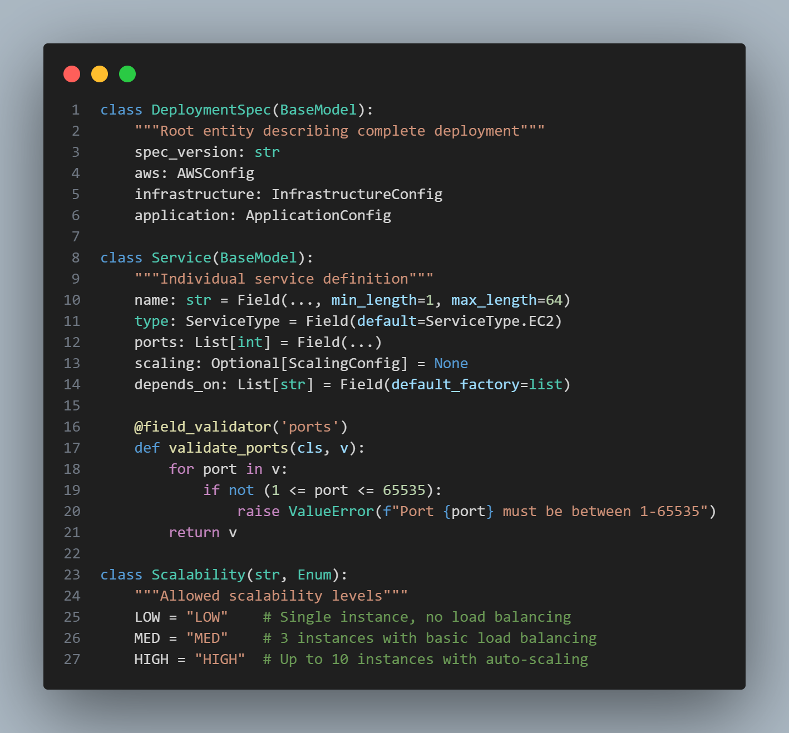


**M2 Characteristics:**
- **Structural constraints**: Required fields, types, cardinality
- **Value constraints**: String lengths, numeric ranges, enum values
- **Relational constraints**: Service dependencies, references
- **Business rules**: Custom validators (circular dependencies, port conflicts)

---

### M1 - Model: User Specification

A **concrete instance** of the M2 metamodel representing actual infrastructure intent:
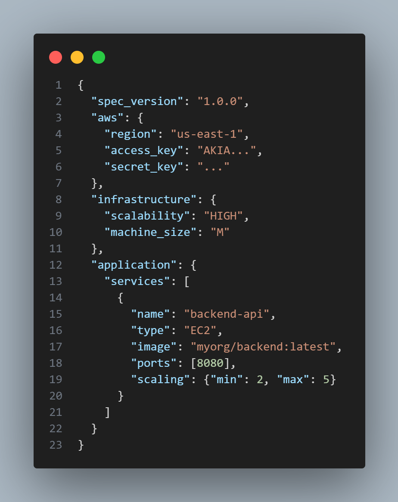


**Validation Process:**
- ✅ Does `scalability` match M2 enum values?
- ✅ Is `machine_size` valid per M2 constraints?
- ✅ Are port numbers in range 1-65535?
- ✅ Are there circular dependencies in `depends_on`?

**Purpose**: Captures user intent in a structured, validated format.

---

### M0 - Real World: Deployed Infrastructure

Tangible AWS resources created from the M1 specification:

**Example M0 Resources:**
- EC2 Instance: `i-0987654321abcdef0` (t3.medium, us-east-1a)
- RDS Database: `myapp-db.c9akciq32.us-east-1.rds.amazonaws.com`
- VPC: `vpc-0123456789abcdef0` with subnets and route tables
- Load Balancer: `arn:aws:elasticloadbalancing:us-east-1:123456789012:loadbalancer/app/...`
- Auto Scaling Group: 2-5 instances based on CPU utilization

**Purpose**: Operational infrastructure matching the M1 specification.

---

### How the Layers Interact
```
M3 (Python/Pydantic)
    ↓ defines structure for
M2 (DeploymentSpec metamodel)
    ↓ validates
M1 (spec.json)
    ↓ transforms via Generator
Terraform Code (.tf files)
    ↓ provisions
M0 (AWS Resources)
```

**Benefits of This Architecture:**

| Benefit | Description |
|---------|-------------|
| **Separation of Concerns** | Language (M3), rules (M2), intent (M1), execution (M0) are independent |
| **Early Validation** | Errors caught at M1 parsing, not during expensive AWS provisioning |
| **User Abstraction** | Users write simple specs (M1); AWS complexity handled by transformations |
| **Extensibility** | Add new service types by updating M2 only |
| **Traceability** | Clear lineage from user intent (M1) to deployed resources (M0) |
| **Backend Independence** | Same M2 can target Terraform, CloudFormation, or Pulumi |

---

## 📋 Specification File Format

The specification file is the **single source of truth** for infrastructure deployment. It defines **what** to deploy, not **how**.

### Complete Example with Advanced Features
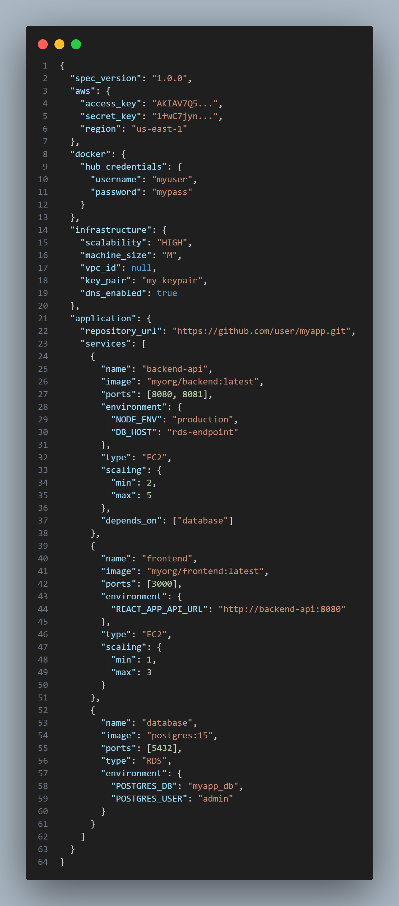


### Field Reference

| Section | Field | Type | Description | Example |
|---------|-------|------|-------------|---------|
| **Root** | `spec_version` | String | Schema version for compatibility | `"1.0.0"` |
| **AWS** | `access_key` | String | AWS IAM access key (≥16 chars) | `"AKIAV7Q5..."` |
| | `secret_key` | String | AWS IAM secret key | `"1fwC7jyn..."` |
| | `region` | String | AWS region for deployment | `"us-east-1"`, `"eu-west-1"` |
| **Docker** | `hub_credentials` | Object | Optional Docker Hub auth | `{"username": "...", "password": "..."}` |
| **Infrastructure** | `scalability` | Enum | Global scaling strategy | `LOW` / `MED` / `HIGH` |
| | `machine_size` | Enum | Default instance size | `S` / `M` / `L` / `XL` |
| | `vpc_id` | String? | Existing VPC ID or `null` to create new | `"vpc-abc123"` or `null` |
| | `key_pair` | String | EC2 SSH key pair name | `"my-keypair"` |
| | `dns_enabled` | Boolean | Enable DNS hostnames in VPC | `true` / `false` |
| **Application** | `repository_url` | String | Git repository URL | `"https://github.com/user/repo.git"` |
| **Service** | `name` | String | Unique service identifier | `"backend-api"` |
| | `image` | String | Docker image reference | `"myorg/backend:latest"` |
| | `ports` | Array[Int] | Exposed ports (1-65535) | `[8080, 8081]` |
| | `environment` | Dict | Environment variables | `{"NODE_ENV": "production"}` |
| | `type` | Enum | Deployment type | `EC2` / `RDS` / `ECS` |
| | `scaling` | Object | Instance count range | `{"min": 2, "max": 5}` |
| | `depends_on` | Array[String] | Service dependencies | `["database"]` |

### Scalability Modes

**LOW** - Development/Testing
- Single instance per service
- No load balancer or auto-scaling
- Cost-efficient for non-production environments

**MED** - Staging/Light Production
- 3 instances per service
- Basic load balancing
- Manual scaling policies

**HIGH** - Production
- 2-10 instances per service (configurable via `scaling.min/max`)
- Application Load Balancer with health checks
- Auto Scaling Groups with CPU-based policies
- High availability across multiple AZs

---

### Validation Rules

The system enforces these constraints:

✅ **Structural Validation:**
- All required fields present
- Correct data types
- Valid enum values

✅ **Semantic Validation:**
- No circular dependencies in `depends_on`
- Unique service names
- Non-conflicting port numbers
- AWS region validity
- Service type compatibility (e.g., RDS services cannot have Dockerfiles)

✅ **AWS-Specific Validation:**
- Valid access key format (16-128 characters)
- Valid region codes
- Key pair names match existing AWS keys

---

## 🔧 Metamodel Design with Ecore (EMF)

While the metamodel is primarily implemented in Python/Pydantic for execution, it can be formally specified using **Ecore** (the metamodeling language of Eclipse Modeling Framework) for documentation, code generation, and academic rigor.

### What is Ecore?

Ecore is an industry-standard metamodeling notation based on UML. It provides:
- **Structural definition**: Classes, attributes, references with full cardinality support
- **Constraint specification**: Min/max values, validation rules
- **Visual representation**: UML-like diagrams for communication
- **Code generation**: Automatic generation of metamodel code in Java, Python, etc.

### Core Metamodel Entities

The Ecore metamodel defines these core **EClasses** (metamodel classes):

#### **EClass: DeploymentSpec**
**Represents**: Root specification container
**Attributes**:
- `spec_version: EString` – Version of specification format
**References** (Containment):
- `aws: AWSConfig` [1..1] – AWS credentials and region
- `infrastructure: InfrastructureConfig` [1..1] – Infrastructure settings
- `application: ApplicationConfig` [1..1] – Application and services
- `docker: DockerConfig` [0..1] – Optional Docker Hub credentials

#### **EClass: AWSConfig**
**Represents**: AWS authentication and deployment region
**Attributes**:
- `access_key: EString` [required, min 16 chars] – IAM access key
- `secret_key: EString` [required] – IAM secret key
- `region: EString` [required] – AWS region identifier

**Validation Constraints**:
- `region` must be valid AWS region (us-east-1, eu-west-1, etc.)

#### **EClass: InfrastructureConfig**
**Represents**: Global infrastructure parameters
**Attributes**:
- `scalability: Scalability [1..1]` – Global scalability level (default: MED)
- `machine_size: MachineSize [1..1]` – Default machine size (default: M)
- `vpc_id: EString [0..1]` – Existing VPC ID or null to create new
- `key_pair: EString [0..1]` – SSH key pair for EC2
- `dns_enabled: EBoolean` – Enable DNS hostnames

#### **EClass: Service**
**Represents**: Deployable service (compute or database)
**Attributes**:
- `name: EString` [required, 1-64 chars, alphanumeric+hyphen+underscore]
- `type: ServiceType` [required] – EC2, RDS, or ECS
- `ports: EInt[]` [0..*] – Exposed ports (1-65535)
- `dockerfile_path: EString [0..1]` – Path to Dockerfile
- `image: EString [0..1]` – Docker image URL
- `environment: EMap<String, String>` [0..1] – Environment variables
- `depends_on: EString[]` [0..*] – Service dependencies (names)

**References** (Containment):
- `scaling: ScalingConfig [0..1]` – Per-service scaling override

**Validation Constraints**:
- Either `dockerfile_path` OR `image` must be present (XOR constraint)
- Ports must be in range [1, 65535] and non-conflicting
- `depends_on` must reference existing service names

#### **EClass: ScalingConfig**
**Represents**: Service-level autoscaling parameters
**Attributes**:
- `min: EInt` [1..100] – Minimum instances
- `max: EInt` [1..100] – Maximum instances

**Constraints**:
- `min <= max`

#### **EClass: ApplicationConfig**
**Represents**: Application definition and service list
**Attributes**:
- `repository_url: EString [0..1]` – Git repository URL
**References** (Containment):
- `services: Service[]` [1..*] – Services to deploy (at least one)

#### **EEnum: ServiceType**
```
ServiceType {
  EC2 = 0    // Compute service (Docker container)
  RDS = 1    // Managed database
  ECS = 2    // Container orchestration (reserved)
}
```

#### **EEnum: MachineSize**
```
MachineSize {
  S = 0      // Small (t3.micro)
  M = 1      // Medium (t3.medium)
  L = 2      // Large (t3.large)
  XL = 3     // Extra Large (t3.xlarge)
}
```

#### **EEnum: Scalability**
```
Scalability {
  LOW = 0    // Single instance, no ALB/ASG
  MED = 1    // Up to 3 instances
  HIGH = 2   // Up to 10 instances
}
```

### Screenshots to Capture

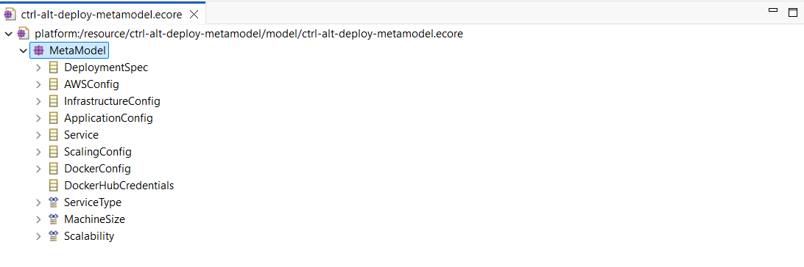
<p align="center"><b>Figure: </b>Tree view showing all EClasses, EEnums </p>


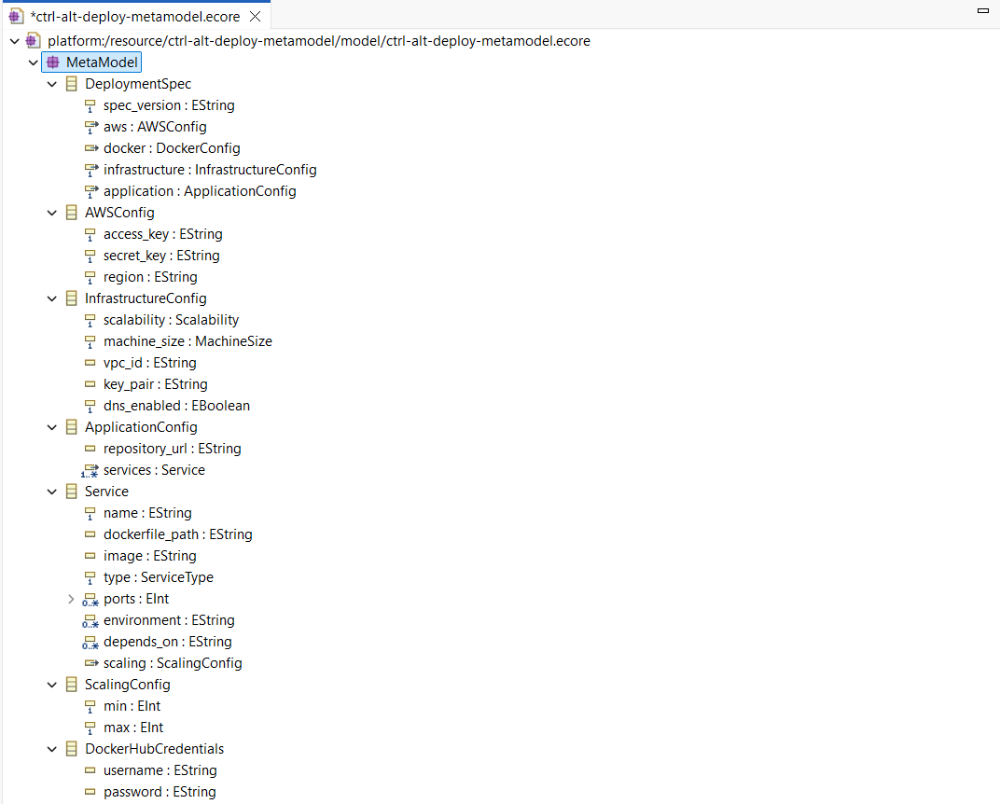

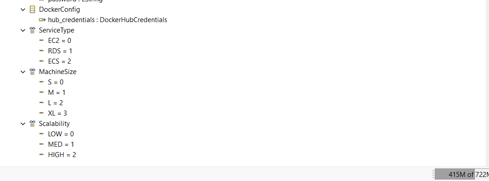
<p align="center"><b>Figure: </b>Detailed view of Service EClass with attributes and relationships </p>


---

## 🎬 Demonstration & Results

This section showcases Ctrl-Alt-Deploy in action with real examples, scalability scenarios, and AWS deployment screenshots.

### Example 1: LOW Scalability Deployment

**Scenario**: A simple development environment with a single service

**Specification** (`spec_low.json`):
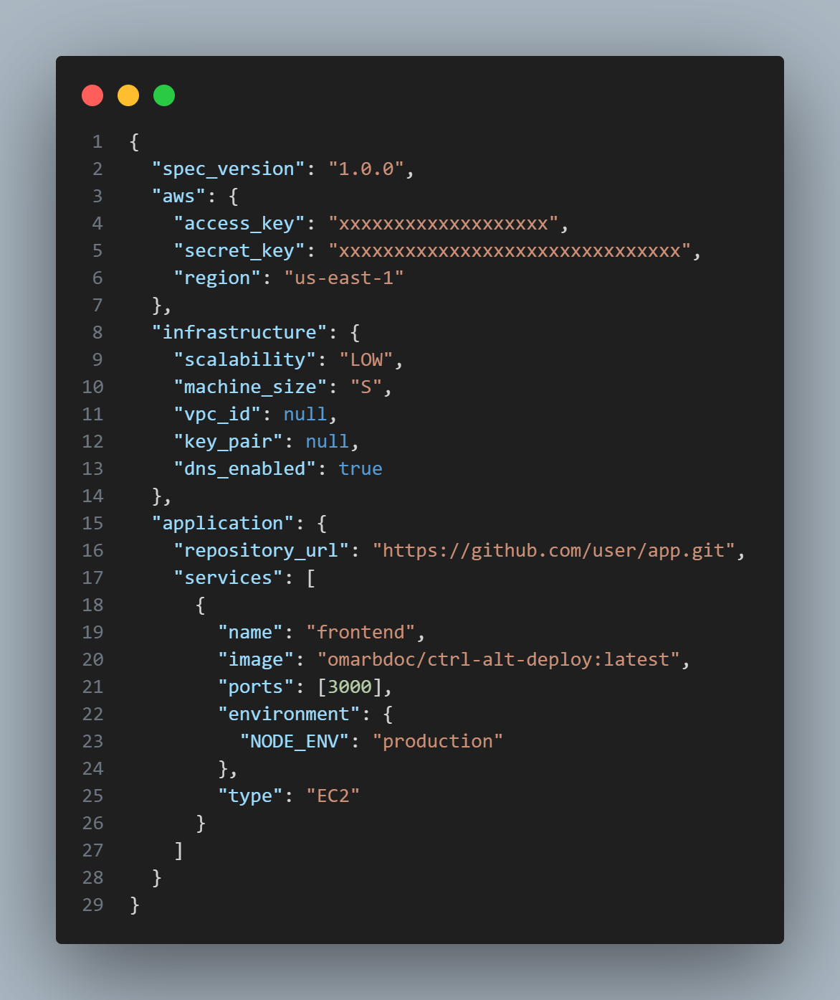


**Deployment Characteristics**:
- **Scalability**: LOW → Single t3.micro (1 vCPU, 1GB RAM)
- **Infrastructure**: Single EC2 instance only
- **Load Balancing**: None (ALB not created)
- **Autoscaling**: None (ASG not created)
- **Cost**: ~$7/month (t3.micro within free tier)
- **Use Case**: Development, testing, low-traffic applications


The generated Terraform configuration creates:
- VPC with public subnet
- Internet Gateway for external access
- EC2 security group with port 3000 open
- Single EC2 instance (t3.micro)
- No load balancer or autoscaling


**AWS Console Result**:

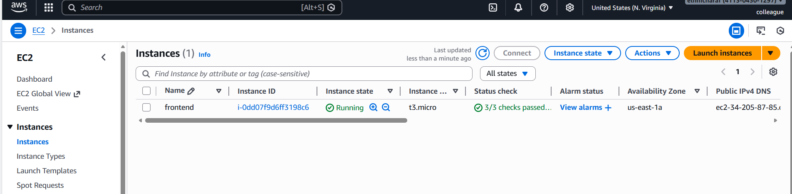

EC2 Dashboard displays:
- 1 running instance (t3.micro)
- Public IP: `34.238.X.X`
- Instance state: Running
- No ASG or ALB listed
---
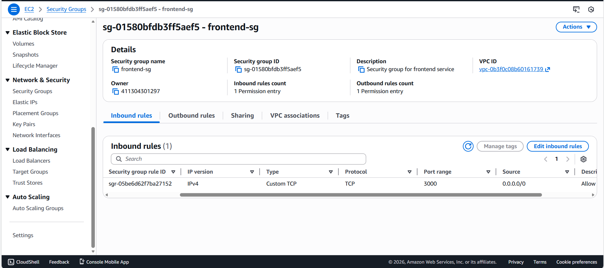
<p align="center"><b>Figure: </b>Security group configuration with port 3000 publicly accessible from any IP address (sg of frontend instance) </p>

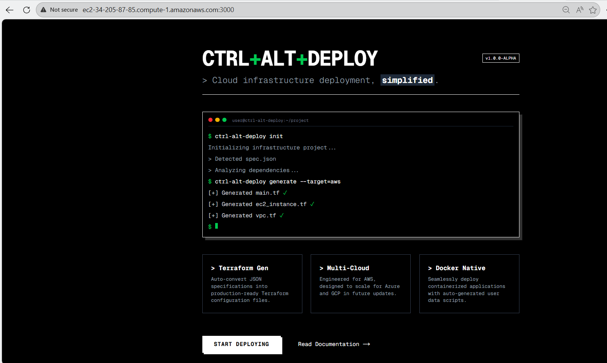
<p align="center"><b>Figure: </b> Application deployed and accessible through public dns at port 3000</p>


### Example 2: HIGH Scalability Deployment

**Scenario**: Production environment with multiple services and autoscaling

**Specification** (`spec_high.json`):
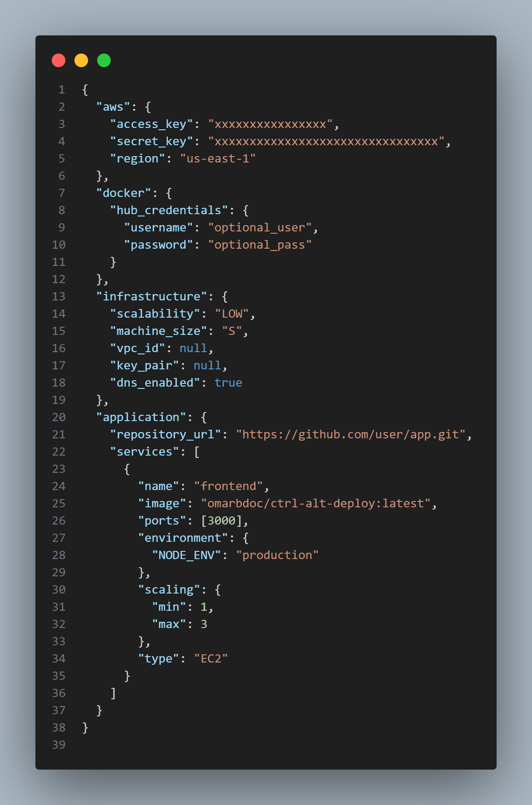


**Deployment Characteristics**:
- **Scalability**: LOW → 1instance
- **Frontend**: 1-3 t3.medium instances with ASG
- **Load Balancing**: Application Load Balancer (ALB) with target groups
- **Infrastructure Resources**:
    1 VPC with public/private subnets
    1 Application Load Balancer
    1 Target Group (frontend)
    1 Auto Scaling Group (frontend with 1-3 instances)
    Security groups with intelligent routing rules
    Internet Gateway for external connectivity
**AWS Console Result**:

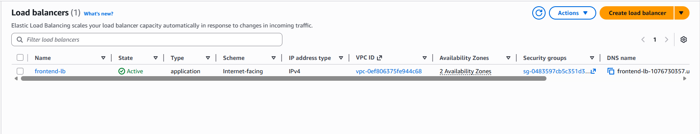
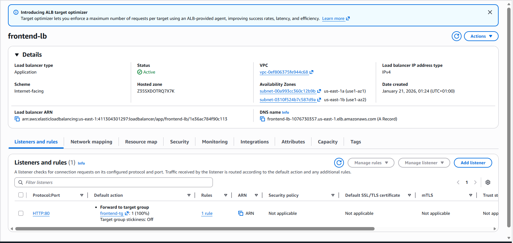
<p align="center"><b>Figure 2:</b> ALB Details - DNS name endpoint: `http://frontend-lb-1076730357.us-east-1.elb.amazonaws.com/` for external access</p>

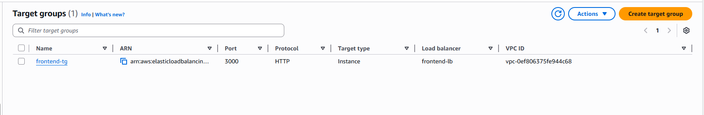
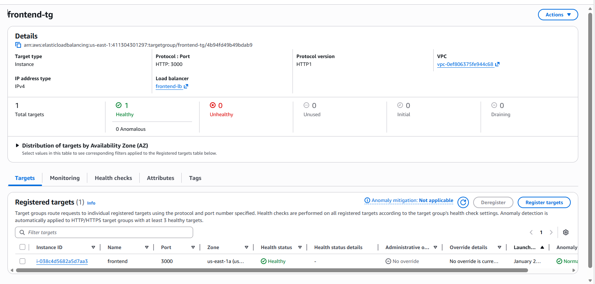

<p align="center"><b>Figure 3:</b> Target Group showing registered frontend instances with health check status (all healthy)</p>

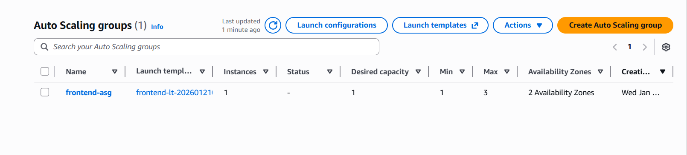
<p align="center"><b>Figure 4:</b> Auto Scaling Group configuration with desired capacity (1-3), running instances, and scaling policies</p>


<p align="center"><b>Figure 5:</b> Application successfully deployed and accessible via ALB DNS endpoint with response times showing load distribution</p>


---

### Execution Flow Walkthrough


**Step 1: Validation Phase**
```bash
$ deploy run spec_high.json

📄 Parsing specification file: spec_high.json
✓ File loaded successfully
✓ Syntactic validation passed
✓ Semantic validation passed

✅ All validations passed! Specification is valid.
```

Parser logs show successful progression through validation stages.

**Step 2: Code Generation Phase**
```bash
🚀 Generating Terraform configuration...
✓ Infrastructure mapping completed
✓ Generated: main.tf
✓ Generated: vpc.tf
✓ Generated: alb.tf
✓ Generated: asg.tf
✓ Generated: backend_api_ec2.tf
✓ Generated: frontend_ec2.tf
✓ Generated: rds_instance.tf
✓ Generated: security_groups.tf
✓ Generated: variables.tf
✓ Generated: outputs.tf

✅ Terraform files written to: ./terraform_output/
```

Generator produces organized `.tf` files ready for execution.

**Step 3: Terraform Execution Phase**
```bash
🔧 Executing Terraform...

Terraform will perform the following actions:

  + aws_vpc.main (will be created)
  + aws_subnet.public (will be created)
  + aws_internet_gateway.main (will be created)
  + aws_lb.main (will be created)
  + aws_autoscaling_group.backend_api (will be created)
  + aws_autoscaling_group.frontend (will be created)
  + aws_db_instance.postgres (will be created)
  ... (50+ total resources)

Terraform plan: Plan: 57 to add, 0 to change, 0 to destroy.

Do you approve? [yes/no]: yes

aws_vpc.main: Creating...
aws_vpc.main: Creation complete after 2s
aws_subnet.public: Creating...
aws_internet_gateway.main: Creating...
... (provisioning in progress)

Apply complete! Resources: 57 added, 0 destroyed.

✅ Infrastructure provisioning completed!

Outputs:
  alb_dns_name = "ctrl-alt-deploy-alb-123456.us-east-1.elb.amazonaws.com"
  backend_api_instances = ["i-0123456789", "i-0987654321"]
  database_endpoint = "myapp-db.c9akciq32.us-east-1.rds.amazonaws.com"
  frontend_instances = ["i-abcdefghij"]
```

All resources provisioned successfully in AWS.

---

## 🚀 Usage Guide

### Prerequisites

Before using Ctrl-Alt-Deploy, ensure your system has:

- **Python 3.11+**
- **Terraform CLI** (version 1.5+)
- **AWS Account** with IAM credentials
- **AWS CLI** (optional, for verification)
- **Docker** (for running containerized services)

### Installation Steps

**1. Clone Repository**
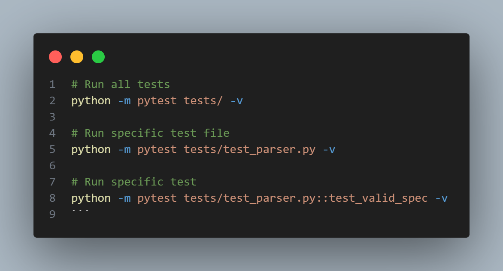

**3. Set Up AWS Credentials** 
 AWS Credentials File (~/.aws/credentials)
```
[default]
aws_access_key_id = YOUR_AWS_ACCESS_KEY
aws_secret_access_key = YOUR_AWS_SECRET_KEY
```

**4. Verify Terraform Installation**
```bash
terraform --version
# Expected: Terraform v1.5.0 or higher
```

### Basic Workflow

#### **Step 1: Create Specification File**

Create `my_infrastructure.json`:
```json
{
  "aws": {
    "access_key": "YOUR_AWS_ACCESS_KEY",
    "secret_key": "YOUR_AWS_SECRET_KEY",
    "region": "us-east-1"
  },
  "infrastructure": {
    "scalability": "MED",
    "machine_size": "M"
  },
  "application": {
    "services": [
      {
        "name": "my-app",
        "image": "myorg/my-app:latest",
        "ports": [8080],
        "type": "EC2"
      }
    ]
  }
}
```

#### **Step 2: Validate Specification**

```bash
python -m src.cli validate my_infrastructure.json
```

**Expected Output**:
```
📄 Parsing specification file: my_infrastructure.json
✓ File loaded successfully
✓ Syntactic validation passed
✓ Semantic validation passed

✅ All validations passed! Specification is valid.
```

If validation fails, detailed error messages identify issues:
```
❌ Syntactic validation failed:

  • aws → region
    Ensure this value has at least 5 characters. [type=string_too_short, ...]
```

#### **Step 3: Generate Terraform Code**

```bash
python generate_tf.py my_infrastructure.json
```

**Expected Output**:
```
✓ Infrastructure mapping completed
✓ Generated: main.tf
✓ Generated: vpc.tf
✓ Generated: ec2_instance.tf
✓ Generated: security_groups.tf
✓ Generated: variables.tf
✓ Generated: outputs.tf

✅ Terraform files written to: ./terraform_output/
```

**Files Generated** (in `terraform_output/`):
- `main.tf` – Provider configuration, variables, outputs
- `vpc.tf` – VPC, subnets, internet gateway
- `ec2_instance.tf` – EC2 instances
- `alb.tf` – Application Load Balancer (if HIGH scalability)
- `asg.tf` – Auto Scaling Groups (if HIGH scalability)
- `rds_instance.tf` – RDS databases (if RDS services defined)
- `security_groups.tf` – Security groups with proper rules
- `variables.tf` – Input variables
- `outputs.tf` – Output values (IPs, DNS, endpoints)

#### **Step 4: Review Terraform Plan (Dry Run)**

```bash
cd terraform_output
terraform init    # Initialize Terraform (download plugins)
terraform plan    # Preview changes without applying
```

**Expected Output**:
```
Terraform will perform the following actions:

  + aws_vpc.main
      id:             <computed>
      cidr_block:     "10.0.0.0/16"
      enable_dns_hostnames: true

  + aws_instance.my_app
      id:             <computed>
      ami:            "ami-0c55b159cbfafe1f0"
      instance_type:  "t3.medium"
      tags:           {"Name" = "my-app"}

Plan: 12 to add, 0 to change, 0 to destroy.
```

Review the plan carefully. If resources look correct, proceed to apply.

#### **Step 5: Apply Infrastructure (Provision)**

```bash
terraform apply
```

**At the prompt**, type `yes` to confirm:
```
Do you want to perform these actions?
Terraform will perform the actions described above.
  Only 'yes' will be accepted to approve.

Enter a value: yes
```

**Expected Output**:
```
aws_vpc.main: Creating...
aws_vpc.main: Creation complete after 2s
aws_internet_gateway.main: Creating...
aws_internet_gateway.main: Creation complete after 1s
... (resource creation in progress)

Apply complete! Resources: 12 added, 0 destroyed.

Outputs:

  instance_ip = "34.238.X.X"
  instance_id = "i-0123456789abcdef0"
```

Infrastructure is now live in AWS!

Or you can all these steps using the command:
```bash
python src/cli.py run my_infrastructure.json
```

### Verification

**Check AWS Console**:
1. Log in to [AWS Management Console](https://console.aws.amazon.com)
2. Go to EC2 → Instances
3. Verify your instance is running
4. Note the public IP address

**Test Connectivity** (if HTTP service):
```bash
curl http://34.238.X.X:8080
# Or in browser: http://34.238.X.X:8080
```

### Troubleshooting

| Issue | Solution |
|-------|----------|
| **Validation Fails: Region Invalid** | Ensure AWS region is valid (e.g., `us-east-1`, `eu-west-1`) |
| **Terraform: Provider Authentication Failed** | Check AWS credentials in spec or environment variables |
| **Instance Not Reachable** | Verify port is correct in spec; check security group in AWS console |
| **Terraform: VPC Conflict** | If `vpc_id` is null, ensure you're not creating duplicate VPCs; use existing VPC ID |
| **Services Not Starting** | Check Docker image exists and is accessible; verify environment variables |

### Cleanup (Destroy Infrastructure)

**WARNING**: This permanently deletes all resources.

```bash
cd terraform_output
terraform destroy
```

At the prompt, type `yes` to confirm deletion.

---

## 📂 Project Structure

```
ctrl-alt-deploy/
├── README.md                          # Project documentation
├── requirements.txt                   # Python dependencies
├── spec.json                          # Example specification
│
├── src/                               # Main source code
│   ├── __init__.py
│   ├── cli.py                         # CLI entry point
│   ├── orchestrator.py                # Pipeline orchestrator
│   │
│   ├── models/                        # Data models (M2 Metamodel)
│   │   ├── __init__.py
│   │   └── models.py                  # Pydantic models: DeploymentSpec, Service, etc.
│   │
│   ├── validators/                    # Validation layer
│   │   ├── __init__.py
│   │   ├── parser.py                  # Main parser (syntactic + semantic validation)
│   │   └── semantic_validator.py      # Custom business logic validation
│   │
│   └── infrastructure/                # Terraform generation and execution
│       ├── __init__.py
│       ├── mappers/                   # Abstract → Concrete mapping
│       │   ├── __init__.py
│       │   ├── instance_mapper.py     # S/M/L/XL → EC2 instance types
│       │   └── rds_mapper.py          # RDS configuration mapping
│       ├── templates/                 # Jinja2 templates
│       │   ├── __init__.py
│       │   ├── main.tf.j2             # Provider, vars, outputs
│       │   ├── vpc.tf.j2              # VPC and networking
│       │   ├── ec2_instance.tf.j2     # EC2 instance configuration
│       │   ├── alb.tf.j2              # Application Load Balancer
│       │   ├── asg.tigu.j2              # Auto Scaling Groups
│       │   └── rds_instance.tf.j2     # RDS database
│       ├── generators/                # Code generation
│       │   ├── __init__.py
│       │   └── terraform_generator.py # Orchestrates Jinja2 rendering
│       └── executors/                 # Terraform execution
│           ├── __init__.py
│           └── terraform_executor.py  # Runs terraform init/plan/apply
│
├── tests/                             # Test suite
│   ├── __init__.py
│   ├── test_parser.py                 # Tests for parser
│   ├── test_mappers.py                # Tests for mappers
│   ├── test_terraform_generator.py    # Tests for code generation
│   └── test_end_to_end.py             # Integration tests
│
├── terraform_output/                  # Generated Terraform files (output)
│   ├── main.tf
│   ├── vpc.tf
│   ├── ec2_instance.tf
│   ├── variables.tf
│   └── terraform.tfstate              # Terraform state file
│
├── examples/                          # Example specifications
│   └── sample-spec.yaml               # Example YAML spec
│
├── assets/                            # Documentation images
│   └── [screenshots and diagrams]
│
└── bin/                               # CLI binaries
    └── deploy.js                      # Node.js wrapper for CLI
```

### Key Directory Functions

**`src/models/`** – Defines the M2 metamodel using Pydantic. Classes like `DeploymentSpec` and `Service` enforce type safety and structural constraints. The parser uses these models to validate user input.

**`src/validators/`** – Implements two-stage validation:
- `parser.py`: Loads files (JSON/YAML), runs Pydantic validation, orchestrates semantic validation
- `semantic_validator.py`: Applies business logic rules (AWS regions, service dependencies, port conflicts)

**`src/infrastructure/`** – Transforms validated models into runnable infrastructure:
- `mappers/`: Convert abstract specs (S/M/L/XL, LOW/MED/HIGH) to concrete AWS values
- `templates/`: Jinja2 templates render `.tf` files based on validated model
- `generators/`: Orchestrates mapping and templating
- `executors/`: Runs Terraform CLI commands

**`tests/`** – Comprehensive test suite ensuring:
- Parser correctly validates valid/invalid specs
- Mappers produce correct AWS instance types
- Generator creates valid Terraform syntax
- End-to-end flow works correctly

**`terraform_output/`** – Directory where generated Terraform files are written. Terraform uses these to create AWS resources.

---

## 🧪 Testing

Ctrl-Alt-Deploy includes a comprehensive test suite ensuring correctness of each pipeline stage.

### Test Categories

**Parser Tests** (`tests/test_parser.py`):
- Valid specification files pass validation
- Invalid specifications fail with clear error messages
- Syntactic errors detected by Pydantic
- Semantic errors detected by custom validator

**Mapper Tests** (`tests/test_mappers.py`):
- MachineSize values map to correct EC2 instance types
- Scalability levels map to correct instance counts
- RDS configurations generate valid instance types

**Generator Tests** (`tests/test_terraform_generator.py`):
- Generated `.tf` files contain valid Terraform syntax
- All services in spec produce corresponding resources
- Jinja2 templates correctly interpolate variables

**End-to-End Tests** (`tests/test_end_to_end.py`):
- Full pipeline: spec → validation → generation → terraform syntax check
- Multiple scalability scenarios work correctly
- Error handling works throughout pipeline

### Running Tests

```bash
# Run all tests
python -m pytest tests/ -v

# Run specific test file
python -m pytest tests/test_parser.py -v

# Run specific test
python -m pytest tests/test_parser.py::test_valid_spec -v
```

**Expected Output**:
```
tests/test_parser.py::test_valid_spec PASSED
tests/test_parser.py::test_invalid_region FAILED
tests/test_mappers.py::test_instance_type_mapping PASSED
... (60+ tests)

====== 60 passed, 2 failed in 1.23s ======
```

---

## 🔮 Future Perspectives

### Short-Term Enhancements

- **Multi-Provider Support**: Extend framework to generate CloudFormation and Pulumi code from same M1 model
- **Enhanced Visualization**: Web dashboard showing deployed infrastructure topology
- **Policy Enforcement**: Built-in compliance rules (e.g., encryption, tagging standards)

### Long-Term Vision: VS Code Extension

The project roadmap includes developing a **native VS Code extension** that:

1. **Provides Inline Specification Editor**
   - Real-time syntax validation
   - Code completion for service names, AWS regions
   - Validation warnings as user types

2. **Direct Deployment from IDE**
   - One-click "Deploy" button
   - Progress indicator during provisioning
   - Real-time Terraform output in VS Code terminal

3. **Infrastructure Explorer Panel**
   - View deployed resources in tree view
   - Show service dependencies
   - Monitor resource status and costs

4. **Integration Flow**:
   ```
   User opens spec.json in VS Code
     ↓ (Extension loads)
   User clicks "Deploy" button
     ↓ (Validation + generation happens locally)
   Extension runs terraform apply
     ↓ (Progress shown in VS Code output)
   Infrastructure created
     ↓ (Explorer panel shows live resources)
   User can inspect, scale, or destroy from IDE
   ```

5. **GitHub Integration** (future feature)
   - Users provide GitHub URL to public/private repository
   - Extension clones repo
   - Detects `spec.json` automatically
   - Deploys infrastructure with one command

This vision transforms Ctrl-Alt-Deploy from a CLI tool into a **fully integrated development environment** for infrastructure provisioning.

---

## 🎓 Conclusion

Ctrl-Alt-Deploy demonstrates the power and practicality of **Model-Driven Engineering** applied to cloud infrastructure provisioning. By implementing a formal 4-level metamodel pyramid (M3/M2/M1/M0), the system achieves:

1. **Safety**: Errors detected at specification time, not at deployment time
2. **Simplicity**: Users express intent at high abstraction level, not AWS technical details
3. **Automation**: Repetitive transformation tasks eliminated through code generation
4. **Maintainability**: Changes to infrastructure rules propagate consistently
5. **Extensibility**: New providers (Azure, GCP) can be added without modifying metamodel

This project serves as a reference implementation of MDE principles in DevOps, demonstrating how formal metamodeling improves infrastructure provisioning workflows. The combination of Pydantic for M2 implementation, Jinja2 for model-to-text transformation, and Terraform for execution creates a robust, maintainable, and user-friendly infrastructure automation platform.

---
