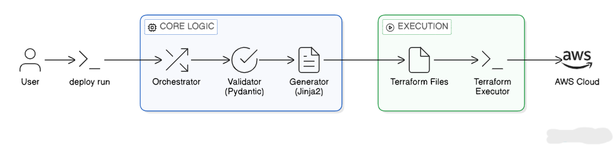
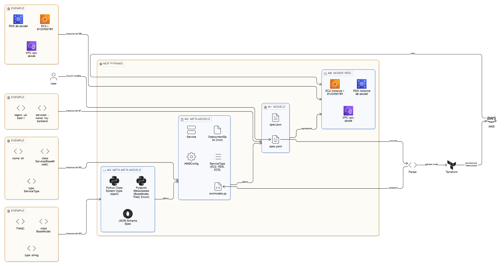
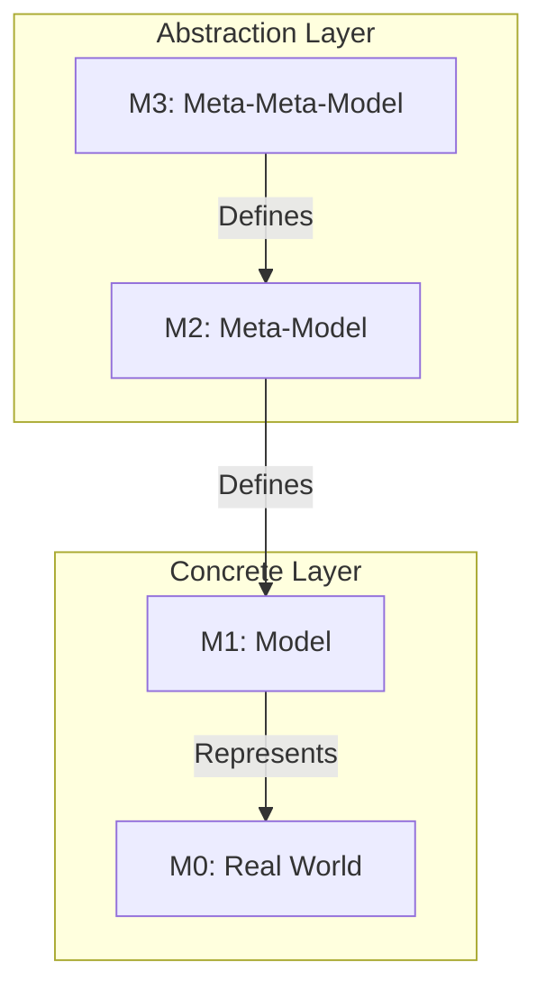
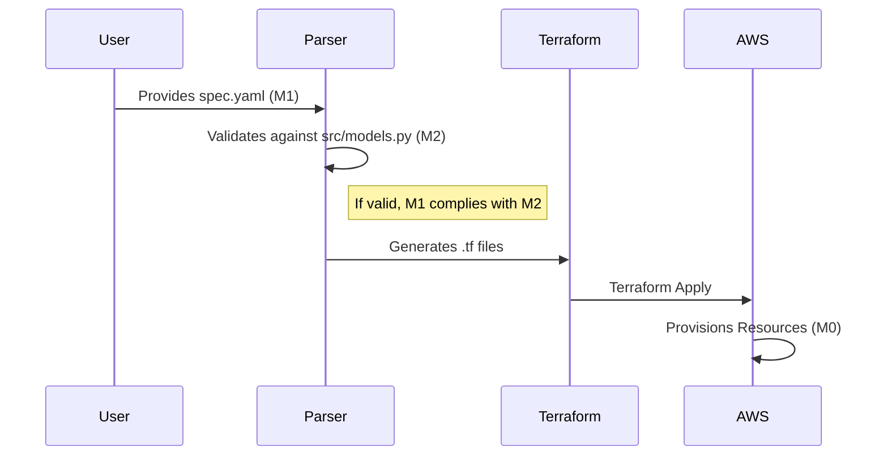

# Ctrl-Alt-Deploy

## Overview

## 📄 Abstract

**Ctrl-Alt-Deploy** is an advanced cloud deployment automation tool that bridges the gap between high-level architectural intent and concrete infrastructure provisioning. By leveraging Model-Driven Architecture (MDA) principles, it allows developers to define complex AWS infrastructures using simple, validated specifications (JSON/YAML), which are then automatically transformed into secure, production-ready Terraform code. This project addresses the complexity of modern cloud operations by providing a robust, 4-layer abstraction pipeline: Input, Validation, Generation, and Execution.

## 📑 Table of Contents

- [🎯 Project Overview](#-project-overview)
  - [The Problem](#the-problem)
  - [The Solution](#the-solution)
  - [Use Cases](#use-cases)
- [🏗️ Technical Architecture](#%EF%B8%8F-technical-architecture)
  - [Technology Stack](#technology-stack)
  - [Architecture Layers](#architecture-layers)
  - [Modeling Concepts](#modeling-concepts)
- [🔄 Workflow](#-workflow)
- [📐 Modeling Architecture (M0 - M3)](#-modeling-architecture-m0---m3)
  - [The Modeling Pyramid (MOF)](#%EF%B8%8F-the-modeling-pyramid-mof)
  - [Level Details](#-level-details)
  - [Transformation Flow](#-transformation-flow-model-transformation)
  - [Why this architecture?](#-why-this-architecture)
- [📂 Project Structure](#-project-structure)
- [⚙️ Installation & Setup](#%EF%B8%8F-installation--setup)
  - [Prerequisites](#prerequisites)
  - [Backend Setup](#1-backend-setup-python)
  - [Frontend Setup](#2-frontend-setup-cli)
- [🚀 Usage](#-usage)
  - [Define your Specification](#1-define-your-specification)
  - [Validate the Specification](#2-validate-the-specification)
  - [Deploy](#3-deploy)
- [🧪 Testing & Quality Assurance](#-testing--quality-assurance)
  - [Running Tests](#running-tests)
  - [Test Categories](#test-categories)
- [🛠 Features](#-features)
- [🤝 Contributing](#-contributing)

---


---

## Goals

- Reduce manual Terraform and AWS setup for small teams and startups
- Enforce consistent, validated deployment specs
- Speed up time-to-deploy with a repeatable workflow
- Keep infrastructure modeling extensible for new services

## High-Level Workflow

1. Parse and validate the spec (syntax and semantics)
2. Map abstract sizes and scalability into AWS resource types
3. Generate Terraform files with Jinja2 templates
4. Run Terraform to plan and apply
5. Surface outputs (instance IDs, public DNS/IP, RDS endpoints)

## Architecture (5 Layers)

1. Input and Validation
   - Pydantic models for structure
   - Semantic validation (service types, ports, dependencies)
2. Infrastructure Mapping
   - Maps S/M/L/XL to instance types
   - Maps LOW/MED/HIGH to scaling policies
3. Core Orchestration
   - Sequencing validation, build, generate, deploy
   - Logging and error handling
4. Infrastructure Automation
   - Terraform CLI execution and output parsing
   - Environment and state handling
5. CLI Interface
   - User-facing commands: validate, run, destroy
   - Progress reporting and summaries

## Specification Format

Supported formats: JSON and YAML.

Minimal example:

```json
{
  "aws": {
    "access_key": "YOUR_AWS_ACCESS_KEY",
    "secret_key": "YOUR_AWS_SECRET_KEY",
    "region": "us-east-1"
  },
  "infrastructure": {
    "scalability": "LOW",
    "machine_size": "S",
    "vpc_id": null,
    "key_pair": null,
    "dns_enabled": true
  },
  "application": {
    "repository_url": "https://github.com/user/app.git",
    "services": [
      {
        "name": "frontend",
        "image": "myorg/frontend:latest",
        "ports": [3000],
        "environment": { "NODE_ENV": "production" },
        "type": "EC2"
      }
    ]
  }
}
```

### Service Types

- EC2: compute services running Docker images
- RDS: managed database services
- ECS: container services (reserved for future expansion)


---

## 🔄 Workflow



---

## 📐 Modeling Architecture (M0 - M3)

This section details the modeling architecture of the **Ctrl-Alt-Deploy** project, following the principles of **Model-Driven Engineering (MDE)** and **Model Driven Architecture (MDA)**.

It conceptually situates our configuration files, Python classes, and actual infrastructure within the **MOF (Meta-Object Facility) pyramid** defined by the OMG.



### 🏛️ The Modeling Pyramid (MOF)

The project structures its data and definitions according to the 4 classic abstraction levels:



### 🔍 Level Details

#### 🔹 M3: Meta-Meta-Model (The Language)
This is the language used to define our meta-model. It provides basic primitives (Class, String, Integer, ValidationRule).
In this project, the M3 level consists of:
*   **Python Class System** (type, object)
*   **Pydantic Metaclasses** (`BaseModel`, `Field`, `Enum`)
*   **JSON Schema Specification** (indirectly, via Pydantic model serialization)

**Role**: Provide the grammar for writing M2.

#### 🔹 M2: Meta-Model (The Structure)
This is the abstract definition of what a "Valid Deployment" is. It does not contain project-specific data, but the structure that any project must respect.
*   **Source files**: `src/models.py`
*   **Components**:
    *   `DeploymentSpec` (Root)
    *   `Service` (Entity)
    *   `AWSConfig` (Configuration)
    *   `ServiceType` (Enumeration: EC2, RDS, ECS)

**Example M2 code (src/models/models.py):**
```python
class Service(BaseModel):
    name: str = Field(..., max_length=64)
    type: ServiceType = Field(default=ServiceType.EC2)
    scaling: Optional[ScalingConfig] = None
    
    @field_validator('ports')
    def validate_ports(cls, v):
        # M2 level validation rule
        ...
```
**Role**: Define authorized rules, types, and relations.

#### 🔹 M1: Model (The Concrete Instance)
This is a specific instance of the meta-model. It is the file written by the user to describe THEIR application.
*   **Files**: `spec.yaml`, `spec.json`
*   **Nature**: Declarative description of a desired infrastructure.

**Example M1 (spec.yaml):**
```yaml
aws:
  region: "us-east-1"

application:
  services:
    - name: "my-backend"  # Instance of M2:Service.name
      type: "EC2"         # Instance of M2:ServiceType
      ports: [8080]
```
**Role**: Capture user intent compliant with M2 rules.

#### 🔹 M0: Real World (Execution)
These are the physical or virtual objects that actually exist during execution.
*   **Elements**:
    *   The EC2 instance `i-0123456789` running on AWS.
    *   The active RDS database.
    *   The VPC created with ID `vpc-abcde`.

**Role**: The tangible operational reality.

### 🔄 Transformation Flow (Model Transformation)

The project acts as a model transformation engine:

1.  **Parsing & Validation**: `M1 (spec.yaml)` -> Validation against `M2 (Pydantic Models)`
2.  **Model-to-Text (M2T)**: The validated model is transformed into Terraform code via Jinja2.
3.  **Execution**: Terraform applies the code to create `M0`.



### 💡 Why this architecture?

*   **Model/Meta-model Separation**: Allows evolving rules (M2) without breaking the engine, simply requiring users to update their files (M1).
*   **Independence**: The model (M1) is agnostic of the final technical implementation (Terraform, CloudFormation, Pulumi). Only the generator changes.
*   **Strong Validation**: Impossible to create an invalid M0 resource because M1 is rigorously verified against M2 before any action.

---

## 📂 Project Structure

- Ports must be 1-65535 and non-conflicting
- Service names must be unique
- RDS services cannot define EC2-only scaling
- Dependencies must reference existing services

## Scalability Model

The spec can define global scalability (LOW, MED, HIGH) and optional per-service overrides. The mapper controls how many instances are created. For LOW, a single EC2 instance is used and no ASG/ALB is created.

## Outputs

Terraform outputs include:

- Instance IDs for EC2 services
- Public IP/DNS for EC2 services (requires VPC DNS hostnames)
- VPC, subnet IDs, and RDS endpoints where applicable

## Project Structure

```
ctrl-alt-deploy/
  src/
    models/                # Pydantic models
    validators/            # Parser and semantic checks
    infrastructure/
      mappers/             # Instance and RDS mapping logic
      templates/           # Jinja2 Terraform templates
      generators/          # Terraform file generation
  examples/                # Sample specs
  tests/                   # Test suite
  generate_tf.py           # CLI entry point for generation
```

## Setup

Prerequisites:
- Python 3.11+
- Terraform CLI

Install dependencies:

```bash
pip install -r requirements.txt
```

## Usage

Validate a spec:

```bash
python -m src.cli validate spec.json
```

Generate Terraform:

```bash
python generate_tf.py spec.json
```

Deploy with Terraform:

```bash
cd terraform_output
terraform init
terraform apply
```

## Troubleshooting

- If public DNS is empty, ensure VPC DNS hostnames are enabled (`dns_enabled: true` for new VPCs).
- If a service is not reachable, confirm the correct port is open in the generated security group.
- Use `terraform output` to verify the instance IP/DNS after apply.

## Security Notes

Never commit real AWS keys. Use environment variables or a secrets manager. Rotate any leaked keys immediately.

## Roadmap

- IDE integration for spec editing and deployment
- Multi-cloud support (Azure/GCP)
- CI/CD integration
- Cost optimization recommendations
